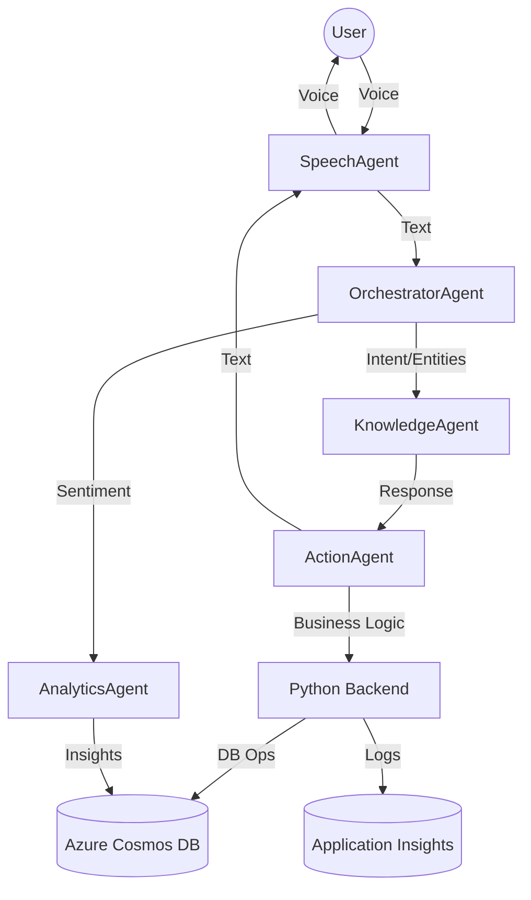
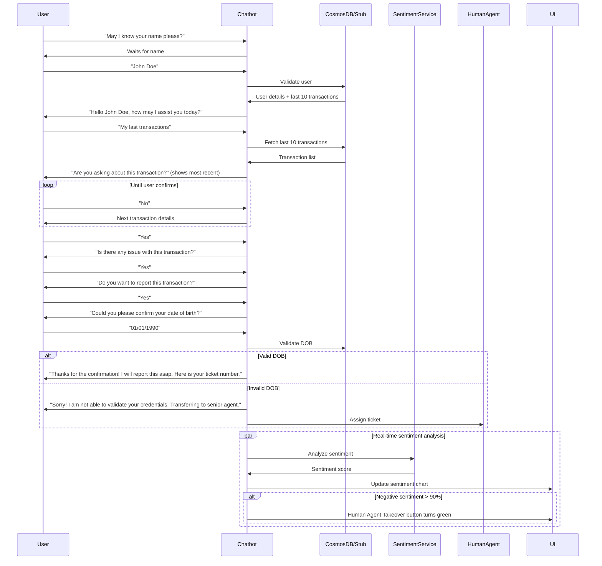

## Workflow Testing Steps

### 1. Start Backend and Frontend
- Run backend in Cosmos DB mode (`uvicorn main:app --reload`) or stub mode (`uvicorn main:app --reload --stub`).
- Start frontend (`npm start`).

### 2. Test User Identification
- Enter a user name (e.g., "Scott ward", "John Doe") in chat UI.
- Confirm bot finds user regardless of case (case-insensitive search).

### 3. Transaction Confirmation Flow
- Request "last transactions" in chat.
- Confirm or reject transactions interactively until correct one is found.

### 4. Issue Reporting and DOB Validation
 Report an issue with a transaction.
 Enter correct or incorrect DOB to test ticket creation and escalation.
 
 **Troubleshooting:**
 If you encounter `UnboundLocalError: local variable 're' referenced before assignment` in the backend, ensure:
 1. Only one `import re` statement exists at the very top of `app/routes/chat.py`.
 2. Remove any duplicate `import re` inside functions or blocks.
 3. Save and restart the backend server.

### 5. Sentiment Analysis and Agent Escalation

### 6. Dual Data Flow Verification
 
 **Python Import Best Practice:**
 Only import modules (like `re`) once at the top of your file. Do not import inside functions unless absolutely necessary.
### 1. Cosmos DB Sample Users
- Run `python app/database/sample_users.py` to generate 100 users with realistic details and last 10 transactions.
- Each user includes: `id`, `userId`, `name`, `address`, `creditCardNumber`, `email`, `phone`, `dob`, `accountBalance`, `createdAt`, and `transactions` array.
- Each transaction includes: `id`, `merchant`, `info`, `address`, `amount`, `timestamp`.

### 2. Stub Data (Local JSON)
- Generated in `database/stub_users.json` for `/stub` mode.
- Matches Cosmos DB schema for seamless workflow testing.
- Example:
```json
{
    "id": "user001",
    "name": "John Doe",
    "dob": "1990-01-01",
    "transactions": [
        { "id": "txn001", "merchant": "Amazon", "info": "Electronics purchase", ... }
    ],
    "key_items": ["Preferred customer", "Recent travel"]
}
```
## Frontend Workflow (UI & API Integration)

### 1. UI Mapping
- Main chat UI interacts with backend via `/chat` (Cosmos DB) or `/stub` (local JSON).
- Route selection determines data source and workflow mode.

### 2. API Calls
- Uses `src/services/api.ts` to POST chat messages and fetch insights.
- Handles user input, bot responses, transaction details, and sentiment updates.

### 3. Transaction Display
- Shows last 10 transactions for identified user.
- Allows user to confirm or reject transactions interactively.

### 4. Sentiment Chart
- Real-time sentiment scores visualized as pie chart or distribution.
- Updates with each user message.

### 5. Human Agent Takeover Button
- Button turns green and is enabled if negative sentiment > 90%.
- Allows manual or automatic escalation to human agent.
## Backend Workflow (API & Bot Logic)

### 1. User Validation
- Bot greets and requests user name.
- Backend searches for user in Cosmos DB (case-insensitive) and, if not found, in stub data.
- On match, returns user details and last 10 transactions.

### 2. Transaction Fetch & Confirmation
- User requests last transactions.
- Bot fetches and displays the most recent transaction.
- User confirms or rejects; bot iterates through transactions until confirmed.

### 3. Issue Reporting & DOB Validation
- If user reports an issue, bot requests date of birth for validation.
- Backend checks DOB against user record.
- On valid DOB, bot creates a ticket and returns ticket number.
- On invalid DOB, bot escalates to human agent.

### 4. Sentiment Analysis
- Each user message is analyzed using Azure Text Analytics.
- Sentiment score and label are returned and visualized in frontend.
- If negative sentiment > 90%, triggers Human Agent Takeover.

### 5. Dual Data Flow
- All logic above works identically for Cosmos DB and stub data (local JSON), depending on route (/chat or /stub).
# finAssist: Voice-Enabled AI Chatbot on Azure

## Project Overview
A robust, scalable, multi-agent AI chatbot system for customer service, leveraging Azure AI, Cosmos DB, and real-time analytics. Features voice input/output, intent recognition, LLM-based responses, sentiment insights, and advanced transaction validation workflows. Supports both live Cosmos DB and local stub data for development and testing.

## Architectural Diagram


## Enhanced Workflow Diagram


## Prerequisites
- Azure CLI
- Terraform
- Node.js
- Python

## Local Environment Setup & Testing

### 1. Clone the repo
```sh
git clone https://github.com/ranit532/finAssist.git
cd finAssist
```

### 2. Provision Azure resources
```sh
cd infra
terraform init
terraform plan
terraform apply
```

### 3. Backend setup
```sh
cd app
# Create a .env file with your Azure Cosmos DB credentials:
# COSMOS_ENDPOINT=your-cosmos-endpoint
# COSMOS_KEY=your-cosmos-key
# COSMOS_DB_NAME=your-db-name
# COSMOS_CONTAINER_NAME=your-container-name
pip install -r requirements.txt
```

### 4. Generate sample user data in Cosmos DB and stub
```sh
python database/sample_users.py
```
This will insert 100 users with realistic sample data, including last 10 transactions (merchant name, info, address, etc.), into Cosmos DB and also generate a local stub JSON file for `/stub` mode.

### 5. Start the backend server (Cosmos DB mode)
```sh
uvicorn main:app --reload
```

### 6. Start the backend server (Stub mode)
```sh
uvicorn main:app --reload --stub
```

### 7. Frontend setup
```sh
cd ../src
npm install
npm start
```

### 8. Test the POC system locally
- Open your browser at `http://localhost:3000` for Cosmos DB mode, or `/stub` for stub mode.
- Interact with the chatbot UI.
- The backend will fetch user data and last 10 transactions from Cosmos DB or stub data, depending on the route.
- Sentiment analysis and workflow steps are visualized in real time and update continuously.
- Human Agent Takeover is triggered automatically if negative sentiment exceeds 90%.

## Azure Services Used & Purpose
| Service                        | Purpose                                                      |
|--------------------------------|--------------------------------------------------------------|
| Azure Cosmos DB                | Stores user profiles, chat history, key items, and last 10 transactions |
| Azure Cognitive Services Speech| Speech-to-Text (STT) and Text-to-Speech (TTS) for voice input/output |
| Azure AI Language (CLU/TextAnalytics) | Intent/entity recognition and sentiment analysis         |
| Azure OpenAI Service           | LLM-based responses and contextual chat                       |
| Azure AI Search                | Intelligent retrieval of company data, FAQs, policies         |
| Azure Application Insights     | Logging and monitoring backend performance                    |
| Azure App Service (Linux)      | Hosts the Python backend API                                  |

Each service is provisioned via Terraform and integrated into the agentic workflow as described above.

## Stub Data Mode
- The `/stub` route and UI allow you to test the full workflow using local stub data (JSON) instead of Cosmos DB.
- Stub data matches the schema of Cosmos DB, including user details and last 10 transactions.
- All bot logic, validation, and sentiment analysis work identically in both modes.

## Transaction Details
- Each user record (in Cosmos DB and stub) includes a `transactions` array with the last 10 transactions.
- Each transaction contains merchant name, info, address, amount, timestamp, and other details.
- The bot can fetch, cache, and interactively confirm transactions with the user.

## Sentiment Analysis & Human Agent Takeover
- Real-time sentiment analysis is performed using Azure Text Analytics or similar.
- Sentiment distribution and pie chart update continuously in the browser.
- If negative sentiment exceeds 90%, the Human Agent Takeover button turns green and is triggered automatically.