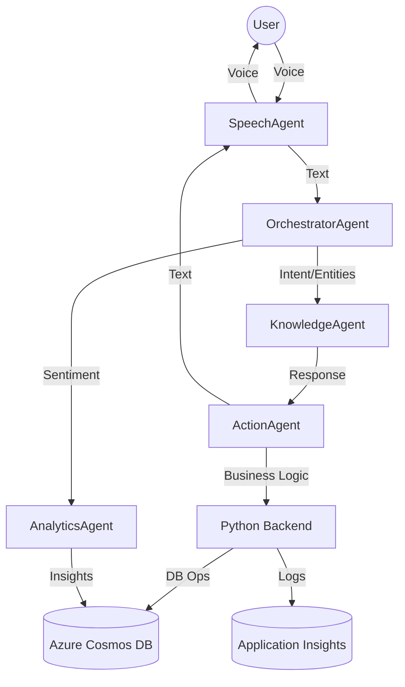
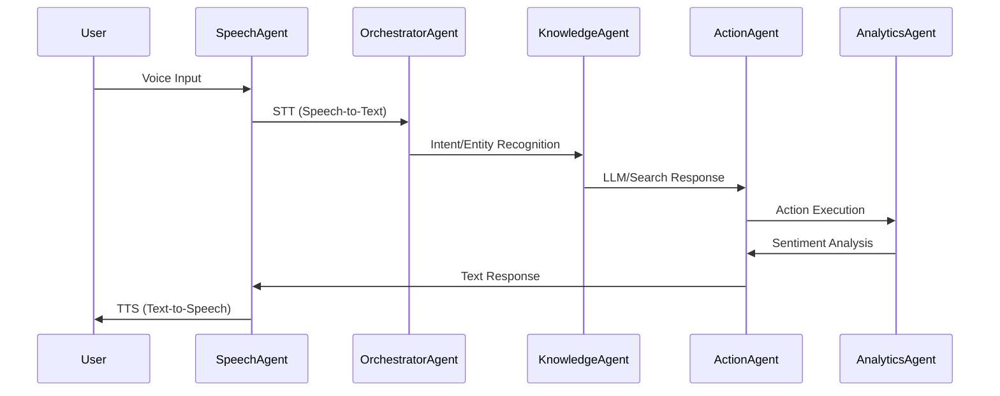

# finAssist: Voice-Enabled AI Chatbot on Azure

## Project Overview
A robust, scalable, multi-agent AI chatbot system for customer service, leveraging Azure AI, Cosmos DB, and real-time analytics. Features voice input/output, intent recognition, LLM-based responses, and sentiment insights.

## Architectural Diagram


## Workflow Diagram


## Prerequisites
- Azure CLI
- Terraform
- Node.js
- Python

## Local Environment Setup & Testing

### 1. Clone the repo
```sh
git clone https://github.com/ranit532/finAssist.git
cd finAssist
```

### 2. Provision Azure resources
```sh
cd infra
terraform init
terraform apply
```

### 3. Backend setup
```sh
cd app
# Create a .env file with your Azure Cosmos DB credentials:
# COSMOS_ENDPOINT=your-cosmos-endpoint
# COSMOS_KEY=your-cosmos-key
# COSMOS_DB_NAME=your-db-name
# COSMOS_CONTAINER_NAME=your-container-name

pip install -r requirements.txt
```

### 4. Generate sample user data in Cosmos DB
```sh
python database/sample_users.py
```
This will insert 100 users with realistic sample data for testing the agentic workflow.

### 5. Start the backend server
```sh
uvicorn main:app --reload
```

### 6. Frontend setup
```sh
cd ../src
npm install
npm start
```

### 7. Test the POC system locally
- Open your browser at `http://localhost:3000`.
- Interact with the chatbot UI.
- The backend will fetch user data from Cosmos DB and render it in the conversational workflow.
- Sentiment analysis and workflow steps are visualized in real time.

## Azure Services Used
- [Azure Cosmos DB](https://learn.microsoft.com/azure/cosmos-db/)
- [Azure AI Language (CLU)](https://learn.microsoft.com/azure/ai-services/language-service/conversational-language-understanding/overview)
- [Azure Cognitive Services Speech](https://learn.microsoft.com/azure/ai-services/speech-service/)
- [Azure OpenAI Service](https://learn.microsoft.com/azure/ai-services/openai/)
- [Azure AI Search](https://learn.microsoft.com/azure/search/)
- [Azure Application Insights](https://learn.microsoft.com/azure/azure-monitor/app/app-insights-overview)